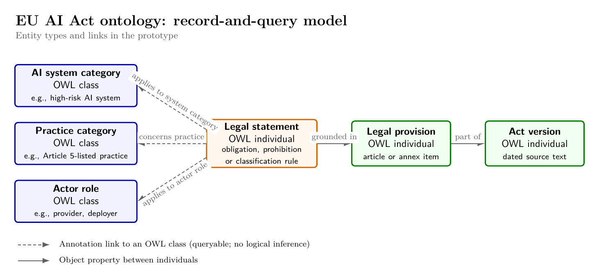

# EU AI Act ontology

A proof-of-concept OWL 2 EL ontology records EU AI Act categories, actors and legal statements. The **record-and-query** approach represents categories as OWL classes. It represents obligations, prohibitions and classification rules as individuals linked to those classes by queryable annotations. The command line builds and checks the ontology and runs SPARQL queries. Protégé displays it.

The validated version is on `main`. The `approach/record-and-query` branch preserves the development history for comparison with future approaches.

## Four deliverables

1. **Ontology:** [`ontology/act-ontology.owl`](ontology/act-ontology.owl) models AI system categories, Article 5 practices, high-risk classification routes, actors and selected obligations, with labels, descriptions and provision links.
2. **AI-assisted pipeline:** [prompts](prompts/pi-qwen/), [raw local Qwen outputs](intermediate/pi-qwen/), [review decisions](intermediate/review.md), [reviewed records](ontology/reviewed-records.json) and [scripts](scripts/) document the extraction and review steps.
3. **Short documentation:** the [one-page technical note](docs/technical-note.md) explains scope, modelling decisions, four competency questions, example SPARQL and an evaluation proposal; the [full queries](queries/) are runnable.
4. **Validation:** the [machine-readable report](reports/validation.json) records OWL 2 EL profile, ELK consistency, evidence and query checks; the [Protégé walkthrough](docs/protege-showcase.md) shows the ontology in the GUI.

## 1. Clone and prepare the environment

```bash
git clone https://github.com/ferzcam/act_ontology.git
cd act_ontology
uv python install 3.10
uv venv .venv --python 3.10
uv pip install --python .venv/bin/python --no-deps -r requirements.txt
```

Install Git, `uv`, Java 21, `pdftotext` (Poppler), `curl` and `sha256sum`. The six pinned packages in `requirements.txt` support mOWL's OWLAPI wrapper, ELK and RDFLib. The `--no-deps` flag skips mOWL's machine-learning dependencies; `requirements.txt` pins the dependencies this project needs. Check `java -version` before you build. Optional tools are Pi with local `borg/qwen3.8-27b`, Pandoc with LaTeX for the technical-note PDF, and Protégé 5.6.9.

## 2. Obtain and verify the Act PDFs

Download the dated consolidated text and the original Official Journal act into gitignored `data/`:

```bash
mkdir -p data
curl -fL -o data/eu-ai-act-consolidated-2026-07-27-en.pdf 'https://eur-lex.europa.eu/legal-content/EN/TXT/PDF/?uri=CELEX%3A02024R1689-20260727'
curl -fL -o data/eu-ai-act-original-2024-en.pdf 'https://eur-lex.europa.eu/legal-content/EN/TXT/PDF/?uri=CELEX%3A32024R1689'
sha256sum -c sources.sha256
```

Both checksum lines must say `OK`. EUR-Lex sometimes returns an empty HTTP 202 bot challenge even when `curl -fL` succeeds. If either hash fails, open the same links in a browser, save the PDFs under the names above, and rerun `sha256sum -c sources.sha256`. Validate only after both hashes match. The dated consolidated text (CELEX `02024R1689-20260727`) helps document the amendments. The original publication (CELEX `32024R1689`) is the authentic base act. The builder checks the consolidated PDF's exact hash.

## 3. Build and validate without Protégé

```bash
.venv/bin/python scripts/ontology.py all
```

This command builds `ontology/act-ontology.owl` from the tracked `ontology/reviewed-records.json` and reloads the OWL file. It checks the OWL 2 EL profile, ELK consistency, unsatisfiable classes, the source PDF's hash, and evidence spans within cited Articles. It also checks that Annex III listing does not entail high-risk status and compares all four SPARQL query results with `queries/expected.json`. A failed check exits nonzero. See `reports/validation.json` for the full result and `"passed": true`. The reviewed ontology has 41 classes and 42 legal statements. The four queries return 10, 8, 19 and 32 rows. Run `build` or `validate` instead of `all` to execute one stage.

Run the saved competency queries directly:

```bash
.venv/bin/python scripts/query.py cq1
.venv/bin/python scripts/query.py cq2
.venv/bin/python scripts/query.py cq3
.venv/bin/python scripts/query.py cq4
```

The [one-page technical note](docs/technical-note.md) gives the four questions, two shorter SPARQL examples, model scope and evaluation proposal. The [four source-to-query traces](docs/trace-examples.md) explain representative results and their legal qualifications.

## 4. Re-run AI candidate extraction (optional)

**You do not need an API key or language model to rebuild the ontology.** The builder reads the tracked `ontology/reviewed-records.json`. The original extraction used a **locally served Qwen3.8-27B model through Pi**. Its prompts and raw outputs remain in `prompts/pi-qwen/` and `intermediate/pi-qwen/`.

To generate new candidate outputs, use a chat-completions model through OpenAI or OpenRouter. Get a key from the [OpenAI API quickstart](https://developers.openai.com/api/docs/quickstart) or [OpenRouter quickstart](https://openrouter.ai/docs/quickstart), then set `OPENAI_API_KEY` or `OPENROUTER_API_KEY` in your environment. Choose a model ID from that provider; `YOUR_CHAT_MODEL` is a placeholder. Keep API keys out of the repository.

```bash
.venv/bin/python scripts/extract_candidates.py --provider openai --model YOUR_CHAT_MODEL --prompt art70 --dry-run
.venv/bin/python scripts/extract_candidates.py --provider openai --model YOUR_CHAT_MODEL --prompt art70
# Or, with OPENROUTER_API_KEY set:
.venv/bin/python scripts/extract_candidates.py --provider openrouter --model YOUR_CHAT_MODEL --all
```

`--prompt art70` runs one saved prompt; `--all` runs all eight. The script saves outputs and model metadata in gitignored `reproduced/<provider>/`. Models and runs may produce different candidates. Compare new candidates with the saved raw outputs, check every claim against the Act, and record corrections as in the [review log](intermediate/review.md). The builder reads only `ontology/reviewed-records.json`, which requires human review before any update.

## 5. View the diagram and render the technical note (optional)

With Pandoc and LaTeX, render the ontology technical note as a one-page PDF:

```bash
pandoc docs/technical-note.md -o docs/technical-note.pdf --pdf-engine=pdflatex -V geometry:margin=0.5in -V fontsize=10pt
```

The diagram shows the entity types and their links:



Git ignores the generated technical-note PDF. The repository tracks its Markdown source and the diagram PNG.

## 6. Showcase in Protégé (optional)

Open `ontology/act-ontology.owl` in Protégé. In **Classes**, expand `AISystem`, `AIPractice`, `ActorRole` and `LegalStatement`. In **Individuals**, inspect `Rule_Article6_3`, `Prohibition_Article5_h` or `Obligation_Article16_e`, and follow their provision links. Choose **Reasoner → ELK → Start reasoner**. Protégé 5.6.9 loaded this file with its bundled ELK 0.6.0 reasoner; see the [screenshot and walkthrough](docs/protege-showcase.md). The command-line checks above repeat the validation without Protégé or a SPARQL plugin.
