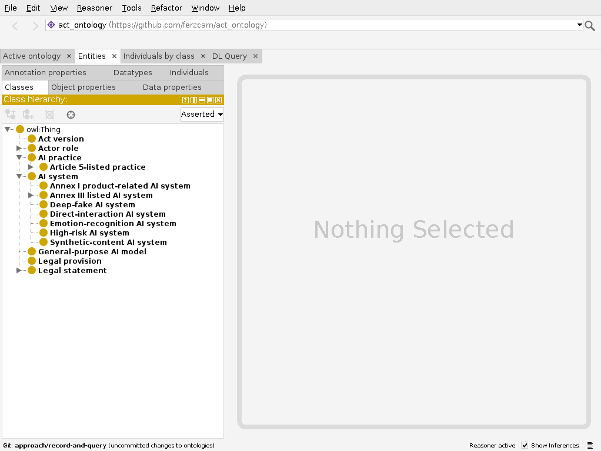

# Protégé showcase walkthrough

On 28 September 2026, Protégé 5.6.9 loaded the ontology with its bundled ELK 0.6.0 reasoner active. The screenshot shows the class hierarchy.

Build and validate the [reviewed ontology](../ontology/act-ontology.owl) with `.venv/bin/python scripts/ontology.py all` before opening Protégé. The command-line tests provide repeatable validation.

1. Open `ontology/act-ontology.owl` in Protégé. In **Classes**, expand `AISystem` to show separate `HighRiskAISystem` and `AnnexIIIListedAISystem` branches. Expand `Article5ListedPractice` under `AIPractice` to show the Article 5 headings. These separate branches preserve the conditions and exceptions recorded in the legal statements.
2. In **Individuals**, inspect `Rule_Article6_2` and `Rule_Article6_3`. Show their `appliesToSystemCategory`, `hasCondition`, `hasException` and `prov:wasDerivedFrom` links. Then inspect `Prohibition_Article5_h` for its public-space scope and exception.
3. Compare `Obligation_Article16_e` and `Obligation_Article_26_6_`. Both concern high-risk systems. Their actor roles and retention terms differ. Follow each `prov:wasDerivedFrom` link to its provision and each `inActVersion` link to the dated source.
4. Select **Reasoner → ELK → Start reasoner**. Inspect the inferred hierarchy and consistency status. The [validation report](../reports/validation.json) records the same consistency check and confirms that Annex III listing alone does not entail high-risk status.
5. Show the entity–relation diagram below beside Protégé. To answer the four competency questions, run `.venv/bin/python scripts/query.py cq1` through `cq4` in a terminal. These commands run the saved SPARQL queries.

Conditions and exceptions remain textual annotations. The ontology records cited legal rules; it does not decide whether a real-world system is legally high-risk or prohibited.
